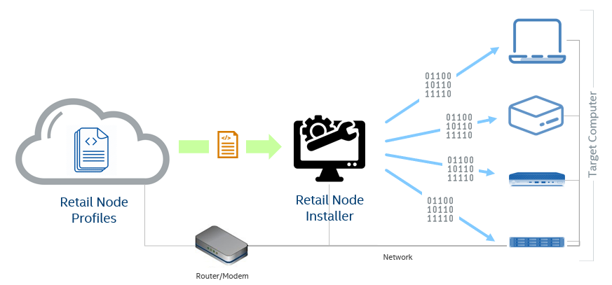
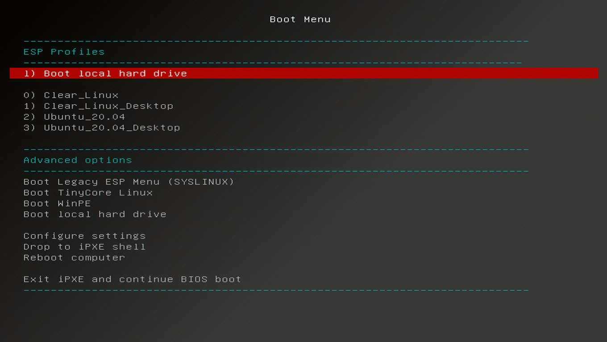

# Edge Software Provisioner (ESP)

## Quick Start Guide

To quickly get started follow the [Quick Deployment Guide](#quick-deployment-guide)

## Table of Contents

1. [What is it?](#what-is-it)

1. [Why do I want it?](#why-do-i-want-it)

1. [Why is it different?](#why-is-it-different)

1. [Introduction](#introduction)

1. [Prerequisites](#prerequisites)

1. [Setting up your Network](#network-setup)

1. [Quick Deployment Guide](#quick-deployment-guide)

1. [Quick Installation Guide](#quick-installation-guide)

1. [Configuring the Edge Software Provisioner (ESP)](#installing-esp)

1. [Upgrading the Edge Software Provisioner (ESP)](#upgrading-esp)

1. [Building Target Devices](#building-target-devices)

1. [Adding and Removing Profiles](#adding-removing-profiles)

1. [Profile Management](#profile-management)

1. [Virtual PXE](#virtual-pxe)

1. [Bootable USB](#bootable-usb)

1. [Dynamic Profile](#dynamic-profile)

## What is it?

The Edge Software Provisioner (ESP) enables ODMs, System Integrators and Developers to automate the installation of a complete operating system and software stack (defined by a Profile) on bare-metal or virtual machines using a "Just-in-Time" provisiong process. The software stack can include software components, middleware, firmware, and applications.  Automating this process increases velocity by focusing resources on rapid development, validation of use cases and scalable deployment.  ESP simplifies customer adoption through confidence gained validating Profiles.  Profiles are cloned and distributed through GitHub containing the human readable prescriptive literature to deploy the complete operating system and software stack.  In summary, this a scalable, simple bare metal provisioning process including virtual machine provisioning.

## Why do I want it?

* This tool potentially can save a team of 30 developers 12,300 man hours that would have been spent on deployment per year.

* This tool potentially can save a system integrator 11,750 man hours in the installation of OS and software stack deploying on 5,000 devices.

## Why is it different?

A majority of ODMs and SI's use the "golden" image method; by building a complete system by hand and then copying the hard drive contents into a "golden" image.  The problem with this process is golden images are not always easily transferrable from hardware to hardware.  Additionally, after a period of time that golden image falls behind from CVE patches causing the ODM or SI to perform additional steps of installation before shipping.  Golden images are large (measured in gigabytes) and require a lot of disk farm to store.

Edge Software Provisioner is a "Just-in-Time" provisioning process; at the time of installation it builds and installs all the components on the target device with the latest and/or fixed release of the software components.  When the ESP OS boots on the target device it "discovers" the hardware and makes adjustments to the installation process through Profile.  Profiles are small (measured in kilobytes) and pulled via a URL.

## Introduction

The Edge Software Provisioner (ESP) is a collection of scripts that enables network-wide [PXE](https://en.wikipedia.org/wiki/Preboot_Execution_Environment) or USB booting of customizable operating systems, referred to as "profiles". It has a lightweight footprint, requiring only Bash, Docker, and Docker Compose. Profiles can be any Linux distribution, such as Clear Linux, Ubuntu, Red Hat, Suse, Yocto, Arch Linux, RancherOS.

The main executable to setup a device as a Edge Software Provisioner is `build.sh`. This script will automatically build a few Docker images, download necessary files as required by profiles, prepare the PXE boot menu, and launch the following dockerized services:

  - **dnsmasq** (provides DHCP and TFTP services)

  - **nginx**

  - **squid** - optional, used for caching http requests

  - **registry** - optional, used for caching Docker images

  - **Gitea** - optional, used for mirroring git repositories

  - **Fluent Bit** - optional, used for logging profile progress

[Clear Linux](https://github.com/intel/esp-profile-clearlinux) and [Ubuntu](https://github.com/intel/esp-profile-ubuntu) are provided as example profiles.

## Prerequisites

The following is required:

* **Profile** - The git URL for at least one profile is required. You will be asked to paste the URL into the configuration file in the following instructions. [Clear Linux](https://github.com/intel/rni-profile-base-clearlinux), [Ubuntu](https://github.com/intel/rni-profile-base-ubuntu) and [RancherOS](https://github.com/intel/rni-profile-base-rancheros) are provided as example profiles.  **See [Adding and Removing Profiles](#adding-removing-profiles) to update the profile list**

* **Edge Software Provisioner** - Minimum Recommended Hardware or VM with 2 CPUs, 20GB HD and 2GB of RAM, running any Linux Distro (headless recommended) that supports Docker
  * `docker` 18.09.3 or greater
  * `docker-compose` v1.23.2 or greater (follow Step 2. of [Quick Installation Guide](#quick-installation-guide) to install) ([official docker-compose guide](https://docs.docker.com/compose/install/))
  * `bash` v4.3.48 or greater

* **Target Device(s)** - Bare-Metal or Virtual Machine(s) with the necessary specifications for your use case. The profile defines what will we be installed and detects hardware on the Target Device. _Note: The Target Devices will be wiped clean during typical usage of the Edge Software Provisioner._

## Network Setup

The Edge Software Provisioner (ESP) must be in an isolated network and there must only be one ESP in the network.  ESP will detect if there is an existing DHCP or DNS and will configure itself accordingly.  It will also detect if the host has a static or dynamic IP IPv4 address.  If the host is a dynamic IP address and if the IP address changes you must run `./build.sh -S -P && ./run.sh --restart` to update ESP configuration with the new IP address.

WARNING: DO NOT RUN ESP ON YOUR CORPORATE NETWORK. *It must be on an isolated network.*

NOTE: If using Ubuntu, do not use Snapd Docker, install Docker using aptitude.  Dnsmasq must not been running on the system from some other service.  Please confirm with `ps -auxww | grep dnsmasq`.

NOTE: When testing with virtual machines, their LAN adapters should be put in Bridge Mode or the VMs must be within the same virtual network.

The ideal setup is a router with an Internet connection and an x86 device like an Intel NUC or VM with Bridge Mode enabled on the LAN adapter.



Because ESP is OS-agnostic and Docker-based, the configuration of your system's network is not something that this guide will cover.

Target Devices will be connected on the same LAN as the Edge Software Provisioner. On target devices, enable PXE Boot in the BIOS if it is not enabled. Most BIOS's have a boot menu option (F12) at POST time. Typically you can press (F12) to alter the boot sequence.

## Quick Deployment Guide

  NOTE: Please read [Network Setup](#network-setup) above before proceeding.  If using Ubuntu, do not use Snapd Docker, install Docker using aptitude.  Dnsmasq must not been running on the system from some other service.  Please confirm with `ps -auxww | grep dnsmasq`.

  1. Copy the following line to deploy Intel Edge Software Provisioner
  ```bash
  wget --no-check-certificate -O- https://raw.githubusercontent.com/intel/Edge-Software-Provisioner/v3.1.2/deploy.sh | bash -s -
  ```

## Quick Installation Guide

  NOTE: Please read [Network Setup](#network-setup) above before proceeding.  If using Ubuntu, do not use Snapd Docker, install Docker using aptitude.  Dnsmasq must not been running on the system from some other service.  Please confirm with `ps -auxww | grep dnsmasq`.

  This guide will help build and run the Edge Software Provisioner docker images.  Depending on the compute power, it will take roughly 5 to 10 minutes to build the images.  To avoid building images every time you install, it suggested to build the images and then publish the images to a container registry.  Following this guide will give you some example steps and tooling to help push the images up to a registry.

  1. ALL the following commands must run as ROOT.  Type `sudo su -` and the your password before proceeding.  (DO NOT prepend sudo to every command.  `sudo su -` means load root environment versus sudo prepended uses your user's environment to the run commands.)
  ```bash
  sudo su -
  ```

  2. Install Docker Compose
  ```bash
  mkdir -p /usr/local/bin
  wget -O /usr/local/bin/docker-compose "https://github.com/docker/compose/releases/download/1.25.4/docker-compose-$(uname -s)-$(uname -m)"
  chmod a+x /usr/local/bin/docker-compose
  ```
  
  3. Clone this project to /opt/esp
  ```bash
  cd /opt
  git clone -b master --depth=1 https://github.com/intel/Edge-Software-Provisioner.git esp
  cd esp
  ```

  4. Build the ESP services. This will take about 5 to 10 minutes.
  ```bash
  ./build.sh
  ```

  5. Start the ESP services.
  ```bash
  ./run.sh
  ```

  6. Attach to the target system or VM to the same network as ESP.  Turn it on and make sure PXE is enabled in the BIOS or press F12 or F11 at boot to boot from network.  You will see the following screen.
  

  7. The default login username is `sys-admin` and the default password is `P@ssw0rd!`. This password is defined in the `conf/config.yml` as a kernel argument in the profiles.  See the individual profiles for further instructions.

  **Stop rebuilding ESP for each installation! To improve installation efficiency for the next time continue on**

  8. Let's re-tag docker images with your prefix to upload to your Docker Hub account.  The following example will re-tag images to look like `myDockerUser/esp-core:latest`.
  ```bash
  ./build.sh --tag myDockerHubUser
  ```

  9. Now let's push these images to your registry.  Make sure to run `docker login` first.
  ```bash
  ./build.sh --push myDockerHubUser
  ```

  10. Copy the output/docker-compose.yml file to your device or virtual machine you want to run Edge Sofware Provisioner.  On the target device simply run the following.
  ```bash
  docker-compose up -d
  ```

  To simplify further, you can use the example `examples/deploy.sh` script to deploy Edge Software Provisioner in a one line command like the following example command (NOTE: you must move deploy.sh and the docker-compose.yml into your github repo for the following to work):
  ```bash
  wget -O- https://github.com/myuser/esp/raw/branch/master/deploy.sh | bash -s -
  ```

  **See [Adding and Removing Profiles](#adding-removing-profiles) to update the profile list**

## Configuring ESP

Once the prerequisites and network setup have been taken care of, the steps to deployment are as follows.

**Step 1.**

Clone the Edge Software Provisioner repository using your git protocol of choice, and navigate into the cloned directory - use the following code snippet as an example:

```bash
git clone -b master --depth=1 https://github.com/intel/Edge-Software-Provisioner.git esp
cd esp
```

**Step 2.**

Edit the existing `conf/config.yml` or copy `conf/config.sample.yml` to `conf/config.yml`:

```bash
cp conf/config.sample.yml conf/config.yml
```

The config file can look something like this - **please modify the values below, this is not intended to be a working example**:

```yaml
---

#dhcp_range_minimum: 192.168.1.100
#dhcp_range_maximum: 192.168.1.250
#network_broadcast_ip: 192.168.1.255
#network_gateway_ip: 192.168.1.1
#network_dns_primary: 8.8.4.4
#network_dns_secondary: 8.8.8.8
#Whost_ip: 192.168.1.11

profiles:
  - git_remote_url: https://github.com/intel/rni-profile-base-clearlinux.git
    profile_branch: legacy
    profile_base_branch: None
    git_username: ""
    git_token: ""
    name: clearlinux_profile
    custom_git_arguments: --depth=1
    
  - git_remote_url: https://github.com/intel/rni-profile-base-clearlinux.git
    profile_branch: desktop
    profile_base_branch: master
    git_username: ""
    git_token: ""
    name: clearlinux-desktop_profile
    custom_git_arguments: --depth=1

```

Make changes according to your needs, including your GitHub username and [token](https://help.github.com/en/enterprise/2.16/user/articles/creating-a-personal-access-token-for-the-command-line) if needed (using a password is not recommended for security reasons), with the following guidance:

  * Public repositories that do not require a username and token/password **must** have the values of `git_username=""` and `git_token=""`
  * Under the `profiles` section, update the git remote to match the HTTPS-based `git remote` URL for your profile. Also update git remote branch by setting `profile_branch` and if it requires any base branch then update it by setting `profile_base_branch` for your profile else set `profile_base_branch` as **None**
  * Ensure that the network configuration matches your needs. If values are not specified, Edge Software Provisioner will default to a `/24` network with a DHCP range of `x.x.x.100-x.x.x.250`.
  * For special situations, custom git flags can be added on the fly by setting `custom_git_arguments`. It _must_ be defined (see next bullet point), so if no custom git flags are needed, specify `None` or `""`.
  * Every profile must have **all** values defined in the config. For example, you cannot remove `custom_git_arguments`; you must specify a value. This is a [known limitation](#known-limitations).
  * The `name` of the profile will appear as a boot menu option on the target device's PXE menu. It can be any alphanumeric string.

**Step 3.**

Run `./build.sh` as root from the root folder. This script will perform various tasks, such as downloading files for the configured profiles in `conf/config.yml`, generating a PXE boot menu, and other things. Depending on the profiles you've selected, the build process can take a few minutes, and is hands-off.

**Step 4.**

Run `./run.sh` as root. This will start the Edge Software Provisioner services. _It is safe to press `ctrl+C` to quit out of logging safely at any time._

**Edge Software Provisioner has now been deployed successfully!** The next step is to [build a target device](#building-target-devices), which is detailed just below.

## Upgrading ESP

  3. Update to the latest release
  ```bash
  cd /opt/esp
  git pull
  ```

  4. Rebuild the ESP services. This will take about 5 to 10 minutes.
  ```bash
  ./build.sh
  ```

  5. Stop and Retart the ESP services.
  ```bash
  ./run.sh -f
  ```

## Building Target Devices

**Booting Target Devices**

1. Boot the target device while connected to your LAN. Make sure you boot this device from network instead of local disk or cd-rom. This will initiate the PXE boot of your target device from the Edge Software Provisioner.

2. After installation, if the profile is in "release" mode "prod" it will shutdown.  If the profile is in "release" mode "dev" the device will reboot.  This is a kernel parameter set in the config.yml in a profile "release=prod" or "release=dev". Manually select the local disk boot option in the PXE menu when it comes up. If the terminal comes up without an error message and notification to check the error log, then it has built successfully!

## Example Kernel Paramaters used at build time

The following kernel parameters can be added to `conf/config.yml`

* `bootstrap` - RESERVED, do not change
* `ubuntuversion` - Use the Ubuntu release name. Defaults to 'cosmic' release
* `debug` - [TRUE | FALSE] Enables a more verbose output
* `resume` - [TRUE | FALSE] Enables the profile to resume opperation after the last fail.  Useful for developing profiles
* `httppath` - RESERVED, do not change
* `kernparam` - Used to pass additional kernel parameters to the targeted system.  Example format: kernparam=splash:quiet#enable_gvt:1
* `parttype` - RESERVED, do not change
* `password` - Initial user password. Defaults to 'P@ssw0rd!'
* `proxy` - Add proxy settings if behind proxy during installation.  Example: http://proxy.intel.com:800
* `proxysocks` - Add socks proxy settings if behind proxy during installation.  Example: http://proxy.intel.com:1080
* `release` - [prod | dev] If set to prod the system will shutdown after it is provisioned.  Altnerativily it will reboot
* `token` - GitHub token for private repositories, if this profile is in a private respository this token should have access to this repo
* `username` - Initial user name. Defaults to 'sys-admin'
* `network` - By default this installs a basic network if omitted.  Valid options are `bridged` which enables a bonded bridged networks accross all network devices or `network-manager` which gives management to the Network Manager utility.
* `wpassid` - uOS WPA SSID if no ethernet is found
* `wpapsk` - uOS WPA Pre-Shared Key if no ethernet is found
* `wifissid` - Target system WiFi SSID
* `wifipsk` - Target system WiFi Pre-Shared Key

**NOTE: See profile for specific Kernel Parameters**

## Post-deployment Information

**Flags**

Users can get a list of all flags supported by running `./build.sh -h`

**Troubleshooting the Edge Software Provisioner**

Log information is available in `builder.log` in the root folder. In order to monitor the logs you can run `docker-compose logs -f`

If it becomes necessary to delete the Edge Software Provisioner containers and re-create them, run `./run.sh -f` (assuming there are no target devices in your network that are attempting to boot while running this command).

You can use `./run.sh -r` to restart the Edge Software Provisioner containers.

Edge Software Provisioner (ESP) will automatically restart upon system reboot.  To stop ESP, from within the "esp" folder type `docker-compose down`

For any other problems that you may encounter during deployment, please consult the [Known Limitations](#known-limitations) section.

## Adding Removing Profiles

You can add and remove profiles by editing the file `conf/config.yml` from with the Edge Software Provisioner directory.  After making changes to the `conf/config.yml` you will need to update the location cache.  You would type `./build.sh -S` or `./build.sh -S --profile NAME_OF_PROFILE` to rebuild the local cache.  Use the `./build.sh -h` to see list of switches available.

## Profile Management

This section is not required for setting up an Edge Software Provisioner and building target devices, but it provides valuable information about profiles, templating, and file downloads that will help you build your own profiles.

Example profiles: [Clear Linux](https://github.com/intel/rni-profile-base-clearlinux), [Ubuntu](https://github.com/intel/rni-profile-base-ubuntu) and [RancherOS](https://github.com/intel/rni-profile-base-rancheros)

In profiles there are 2 files called `conf/config.yml` and `conf/files.yml`.

* `conf/config.yml` holds the kernel arguments which are passed to the Profile installation process that set things like operating system username and password.

  **Kernel arguments** can be specified in a file called `conf/config.yml` _in the profile's repository_, **not in Edge Software Provisioner itself**, like this:

  ```yaml
  ---

  kernel_arguments: diskencrypt=false release=prod ubuntuversion=bionic arch=amd64 username=admin password=password example.datasources=[url:http://@@HOST_IP@@/profile/@@PROFILE_NAME@@/dyn-ks.yml] 
  ```
  Variables surrounded by `@@` symbols are handled by the templating engine in Edge Software Provisioner. Please read [Templating](#templating) for more information on this topic.

* `conf/files.yml` A profile will likely require external files in order to boot and install. This is solved by specifying them in `conf/files.yml` _inside the profile repository_, **not in Edge Software Provisioner itself**. For an example, please see the `files.yml.sample` in the [Ubuntu](https://github.com/intel/rni-profile-base-ubuntu) profile..  See options `conf/files.yml.sample` in any profile (not included in this repo).

You can pull general files, files from S3, or pull container images etc.  The follwoing are some additional examples.

### Using ISO Download and Mounting

  In your profile modify `conf/files.yml`. Look for section `general_files` or `s3_files` add the `mount_iso_path:` section to mount the iso.  See options `conf/files.yml.sample` in any profile (not included in this repo).

  The following ISO would be accessible via:  http://{ESP_IP_Address}/files/{PROFILE_NAME}/alpine-standard-3.11.5-x86_64/

  ```yaml
  general_files:
    - url: http://dl-cdn.alpinelinux.org/alpine/v3.11/releases/x86_64/alpine-standard-3.11.5-x86_64.iso
      destination_file: alpine-standard-3.11.5-x86_64.iso
      token: None
      mount_iso_path: alpine-standard-3.11.5-x86_64
  ```

### GIT Repo mirroring Example

  Git repo mirroring and caching

  In your profile modify `conf/files.yml`. Add as section called `git_repos:` see example below.  See options `conf/files.yml.sample` in any profile (not included in this repo).

  The following Git Repo would be accessible via:  http://mirror:mirror@{ESP_IP}:3003/mirror/{PROFILE_NAME}___rwo/raw/branch/master/*

  ```yaml
  git_repos:
    - git_url: https://github.com/intel/RetailWorkloadOrchestrator.git
      git_branch: master
      git_username: 
      git_passowrd_or_token: 
      custom_git_arguments: --depth=1
      mirror_repo_name: rwo
  ```

### Build Process

  The "Build Process" will perform any scripted action, for example you could build a linux kernel and stage it on Edge Software Provisioner.

  In your profile modify `conf/files.yml`. Add as section called `build:` see example below.  See options `conf/files.yml.sample` in any profile (not included in this repo).

  The following Git Repo would be accessible via:  http://{ESP_IP}/files/{PROFILE_NAME}/build/*

  ```yaml
  build:
    - container: alpine:3.12
      entrypoint: ""
      cmd: sh -c
      execute: start.sh
  ```

### Legacy ISO Booting

  The "Build Process" will perform any scripted action, for example you could build a linux kernel and stage it on Edge Software Provisioner.

  In your profile modify `conf/files.yml`. Add as section called `base_os_files:` see example below.  See options `conf/files.yml.sample` in any profile (not included in this repo).

  ```yaml
  base_os_files:
    - url: https://releases.ubuntu.com/20.04.2/ubuntu-20.04.2-live-server-amd64.iso
      type: iso
      filename: ubuntu-20.04.2-live-server-amd64.iso
  ```

### Templating

Edge Software Provisioner has a few essential templating capabilies that assist with profile configuration.

In a profile's `conf/config.yml`, for the `kernel_arguments` variable only, the following template variables are supported:

* `@@DHCP_MIN@@` - `dhcp_range_minimum`
* `@@DHCP_MAX@@` - `dhcp_range_maximum`
* `@@NETWORK_BROADCAST_IP@@` - `network_broadcast_ip`
* `@@NETWORK_GATEWAY_IP@@` - `network_gateway_ip`
* `@@HOST_IP@@` - `host_ip`
* `@@NETWORK_DNS_PRIMARY@@` - `network_dns_primary`
* `@@NETWORK_DNS_SECONDARY@@` - `network_dns_secondary`

Any file with the suffix `.esptemplate` in a profile will support all of the above as well as:

* `@@PROFILE_NAME@@`

### Profile Build Scripts

A profile can contain a `build.sh` script (must have executable flags set) that will be executed locally on the builder host before anything else. Templating is also supported, so `build.sh.buildertemplate` files will be processed (as described in the [Templating](#templating) section) and then executed on the builder host itself.

These `build.sh` scripts can be useful for any sort of pre-processing task. One use case might be to download a `.tar.gz` file that contains and `initrd` and `linux` kernel files, extract them, and then host them locally so that the builder host can process them.

### File Downloads and Dependencies

A profile will likely require external files in order to boot and install. This is solved by specifying them in `conf/files.yml` _inside the profile repository_, **not in Edge Software Provisioner itself**. For an example, please see the `files.yml.sample` in the Rancher profile.

### Custom Profiles

* A custom profile can be developed and used with existing base profiles.
  * Base profile will have core logic of installing OS. Please see `pre.sh` script in ClearLinux profile on `base` branch.
  * Base profile will also `post.sh` script for clean up activities. Please see `post.sh` script in ClearLinux profile on `base` branch.
  * Custom profile can have `profile.sh` to support custom features. Please see `profile.sh` script in ClearLinux profile on `rwo` branch.
  * Finally custom profile will have `bootstrap.sh` which will eventually call `pre.sh` from *base* branch, `profile.sh` from *custom* branch and then call `post.sh` from *base* branch again. Please see `bootstrap.sh` script in ClearLinux profile on `rwo` branch.
* To see more details on how to change Edgebuilder configuration to use custom profile, see *step 2*
under [Installation](#installation)

## Virtual PXE

  #### What is it?:

  It allows you to test your profiles and/or build VMs or VMs in a container inline on Edge Software Provisioner without having to boot another machine.

  #### Give it try:

  Perform your regular steps of installing Edge Software Provisioner, configure your profiles, run `./buils.sh` and `./run.sh`.
  To start Viturl PXE run the following in the same directory:
  ```bash
  ./vpxe.sh
  ```

  Type `./vpxe.sh -h` to see othe syntax options.

  #### If using pre-built container images version of ESP, use the following command to start vpxe.sh

  ```bash
  docker exec -it esp_core_1 vpxe.sh 
  ```

## Bootable USB

  #### What is it?:

  Creates bootable USB images to boot target devices without Ethernet or PXE available. Or simply use it to a boot a system outside the network.

  #### Give it try:

  Perform your regular steps of installing Edge Software Provisioner, configure your profiles, run `./buils.sh` and `./run.sh`.
  To start Make USB run the following in the same directory:
  ```bash
  ./makeusb.sh
  ```

  Type `./makeusb.sh -h` to see othe syntax options.

## Dynamic Profile

### Scope

The Dynamic Profile feature allows ESP to install software on a target system without using ESP Menu selection on systems without a monitor or scale production.

### Profile selection

A json file in the following format is used to associate a profile with either the hardware mac address of at least one of the ethernets or cpu type on the target system.  An example json file can be found at `conf/dynamic_profiles.json`, edit this file or place the file on github or http server.
Example JSON File:

```json
{
  "hardwares": [
   {
     "id": "1",
     "mac": "AA:BB:CC:11:22:33",
     "profile": "Ubuntu_21.04"
   },
   {
     "id": "2",
     "cpu": "Intel(R) Xeon(R) CPU D-1557",
     "profile": "Ubuntu_20.04_Desktop"
   }
  ]
}
```

**IMPORTANT: The json structure has to follow the structure above. The current implementation relies on these keys. The implemented hardware related information is "macaddress". If others are desired, the implementation needs to be adapted**

### Enabling the Dynamic Profile

Several things need to be done to enable the Dynamic Profile

#### Adapting config.yml
 In the config.yml, the following section must be present:

 ```yaml
 dynamic_profile:
    enabled: true
    url: "https://###SOME_URL###/dynamic_profiles.json" or leave blank to read from conf/dynamic_profiles.json
    user: "###USE_IF_HOSTED_ON_GITHUB###" or leave blank
    token: "###USE_IF_HOSTED_ON_GITHUB###" or leave blank

 ```
 #### Building and running ESP with Dynamic Profile
 If building for the first time please use the following command
 ```
 ./build.sh
 ```
 Or if you have already built images you use the following command to update configuration
 ```
 ./build.sh -S -P
 ```
 
 you must run is ESP in dynamic mode in order to support the feature with the following command
 ```
 ./run.sh
 ```
 
 

## Known Limitations

* The `conf/config.yml` file must specify ALL values comprehensively, as shown in the `conf/config.sample.yml`. Please use `""` for empty values.
* IPv6 is not supported.
* Edge Software Provisioner must be run on a Linux-native file system, such as `ext4`. Filesystems that cannot properly preserve file permissions are not supported.
* On some distributions of Linux (such as newer versions of Ubuntu 18.04), `systemd-resolved` is already running a DNS server on `localhost`. This will cause the dnsmasq container (which is required) to fail to start due to port binding conflicts. To fix this:
  * Run `./build.sh` normally. It will fail at the final deployment step.
  * Edit `/etc/systemd/resolved.conf` to include the line `DNSStubListener=no`
  * **This step will cause your network connection to drop.** Run `sudo systemctl daemon-reload && sudo systemctl restart systemd-resolved.service`
  * Run `./run.sh` to restart the Edge Software Provisioner services.
  * Test that network connectivity works.
  * Proceed to deploy your target devices.
* Edge Software Provisioner's usage of `aws-cli` can cause keyring issues on desktop versions of Linux. Consider disabling your distro's keyring service, or alternatively, a headless distribution such as Ubuntu server edition will resolve the issue.

## Other Info

You can build behind a proxy like this:

```bash
export HTTP_PROXY=http://proxy.site.com:1234 && \
export HTTPS_PROXY=http://proxy.site.com:1234 && \
./build.sh
```
